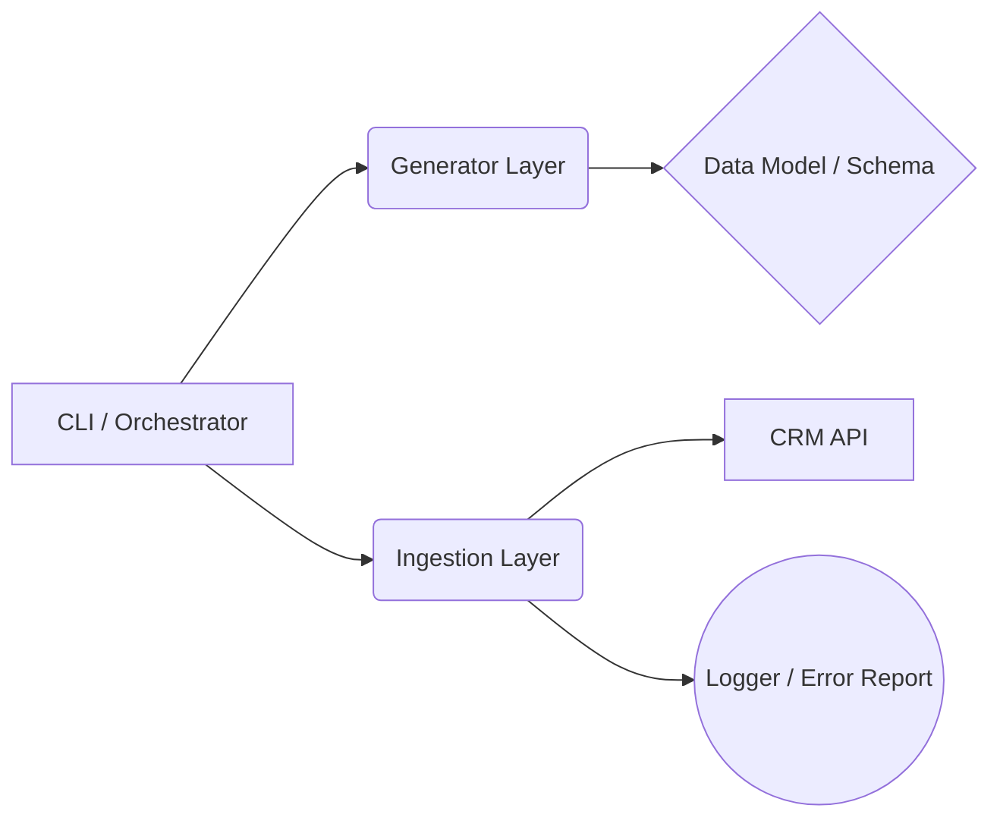

# Generic CRM Data Ingestion Guidelines

This document provides a foundational template and architectural guidelines for building robust data ingestion tools for any CRM system (e.g., Salesforce, Hubspot, Pipedrive). It abstracts key learnings from specific implementations to provide a universal standard for developers.

## 1. Architectural Pattern

A robust ingestion tool should decouple **Data Generation** from **API Interaction**.

*   **Generator Layer**: Responsible *only* for creating valid data payloads. It should not know about API endpoints.
*   **Ingestion Layer**: Responsible for HTTP requests, authentication, retries, and rate limiting.
*   **Orchestrator**: Glues them together (e.g., `main.py`).

## 2. Phase 1: Discovery & Schema Validation

**Context**: CRM documentation is often outdated or generic. Your portal's customization is the source of truth.

### Checklist
- [ ] **API Endpoint Discovery**: Review official documentation to identify:
    *   **Base URL**: e.g., `https://api.crm-provider.com` vs `https://your-instance.crm.com`.
    *   **Ingestion Type**: Does the API support **Batch** (`/batch/create`) or only **Sequential** (`/create`)? Prioritize Batch.
    *   **Limits**: Check Rate Limits (requests/sec) and Payload Limits (records/batch).
- [ ] **Internal Names vs. Labels**: verify property names via the API or internal settings, not the UI label.
    *   *Lesson*: UI might say "Year Founded", but API expects `founded_year`, `year_founded`, or `custom_year_c`.
- [ ] **Data Legend**: Create a mapping of:
    *   **Enums/Dropdowns**: Valid values are strict. Mapping "Sent" (Title Case) when the API expects "SENT" (Upper Case) will fail.
    *   **Dates**: Timestamps (ms vs sec) or ISO Strings (`YYYY-MM-DD`)?
    *   **Booleans**: `true` (JSON) vs `"true"` (String) vs `1` (Int).
- [ ] **Dependencies**: identifying required relations (e.g., cannot create a `Deal` without an associated `Contact`).

## 3. Phase 2: Implementation Standards

### 3.1 Authentication & Scopes
- **Principle of Least Privilege**: Create dedicated integration users or service tokens.
- **Scope Verification**: Attempt a "No-Op" or read call immediately on startup to verify scopes before generating 10,000 records.
    *   *Lesson*: Write permissions for specific objects (e.g., `Products`, `Orders`) often require distinct scopes from standard CRM objects.

### 3.2 Robust Network Interaction
- **Idempotency**: If possible, use `PUT` (Upsert) instead of `POST` (Create) to avoid duplicates on retries.
- **Retries**: Implement exponential backoff for:
    *   `429 Too Many Requests`
    *   `5xx Server Errors`
- **Fail Fast**: Do not retry `400 Bad Request` or `401/403`. These are configuration errors.

### 3.3 Batching Strategy
- **Batch Size**: Find the "Sweet Spot". Too small = rate limits. Too large = timeouts/memory issues. (Common standard: 50-100 records).
- **Throttling**: Implement client-side throttling (sleep) to be a "good citizen" to the API.

## 4. Phase 3: Observability & Debugging

**Context**: When ingestion fails, generic error messages are useless.

### Logging Standards
1.  **Console (stdout)**: informational progress ("Processed batch 5/10").
2.  **Error File (stderr/log)**: Detailed, actionable payloads.
3.  **Raw Response Parsing**: **NEVER** swallow exception details.
    *   *Anti-Pattern*: `print(f"Error: {e}")` -> "400 Bad Request"
    *   *Standard*: Parse the JSON body. Log the specific field causing the error (e.g., `Property 'xyz' does not exist`).

### Isolation Mode
- Create a `debug_script.py` template that isolates dependencies. It should try to insert **one** hardcoded record using a raw HTTP request. This removes application logic complexity when proving API behavior.

## 5. Phase 4: Validation Strategy

### The "Dry Run"
Every ingestion tool MUST have a `--dry-run` flag.
*   **Action**: Generate data, validate against schema constraints, print sample JSON.
*   **Goal**: visual inspection of keys/values before network activity.

### The "Tracer Bullet"
*   **Action**: Run ingestion with `--count 1`.
*   **Goal**: End-to-end verification of Auth + Schema + Network + Logic without polluting the database.

## 6. Template Checklist for Developers

| Requirement | Implementation Guide |
| :--- | :--- |
| **Configurable Environment** | Use `.env` or Environment Variables for Secrets. Never hardcode tokens. |
| **Separation of Concerns** | `Generator` classes should return Dictionaries. `Inserter` classes should take Lists of Dictionaries. |
| **Error Transparency** | Log full JSON responses from 400 errors. |
| **Clean Up** | (Optional) Mechanism to delete test data generated during dry runs. |
